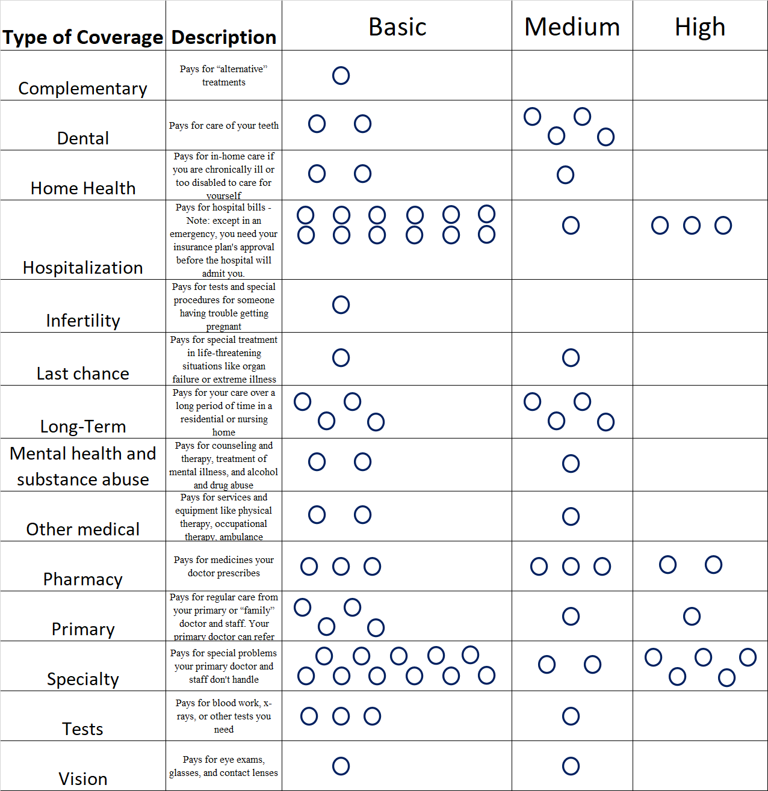
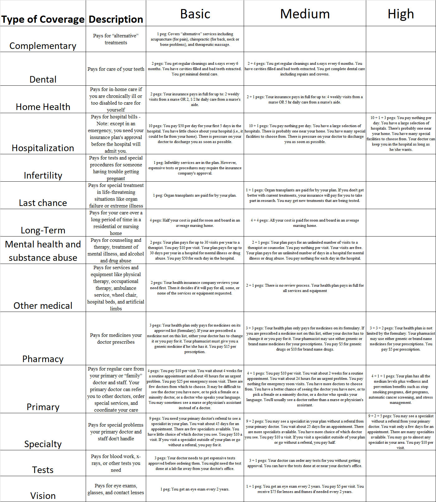
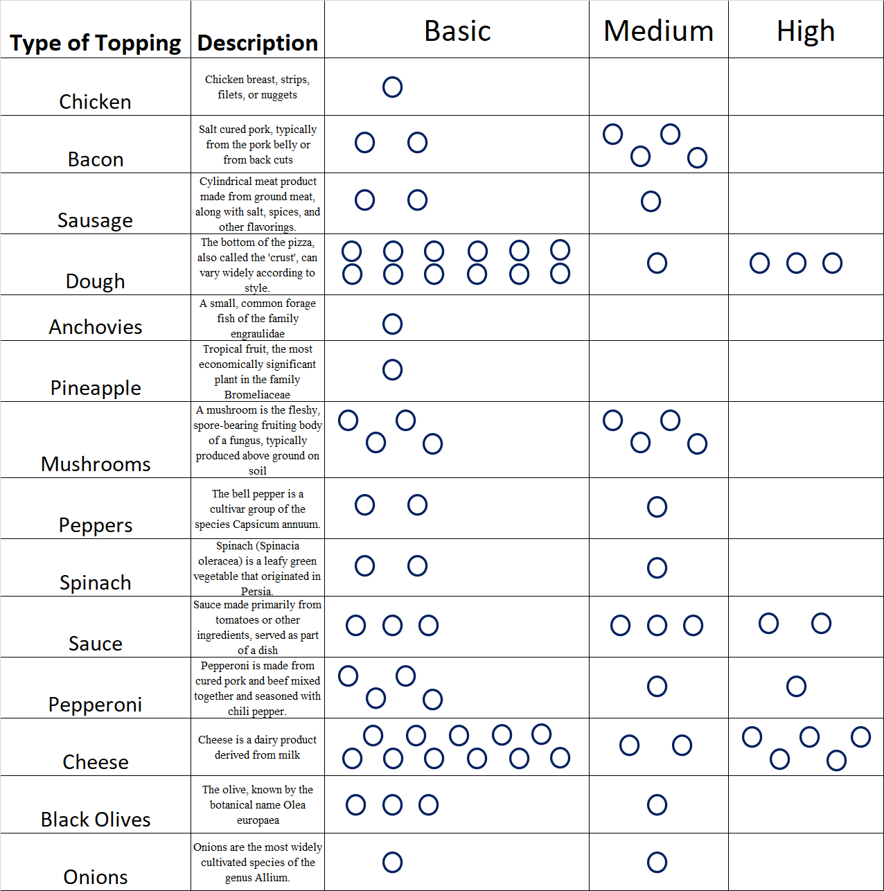
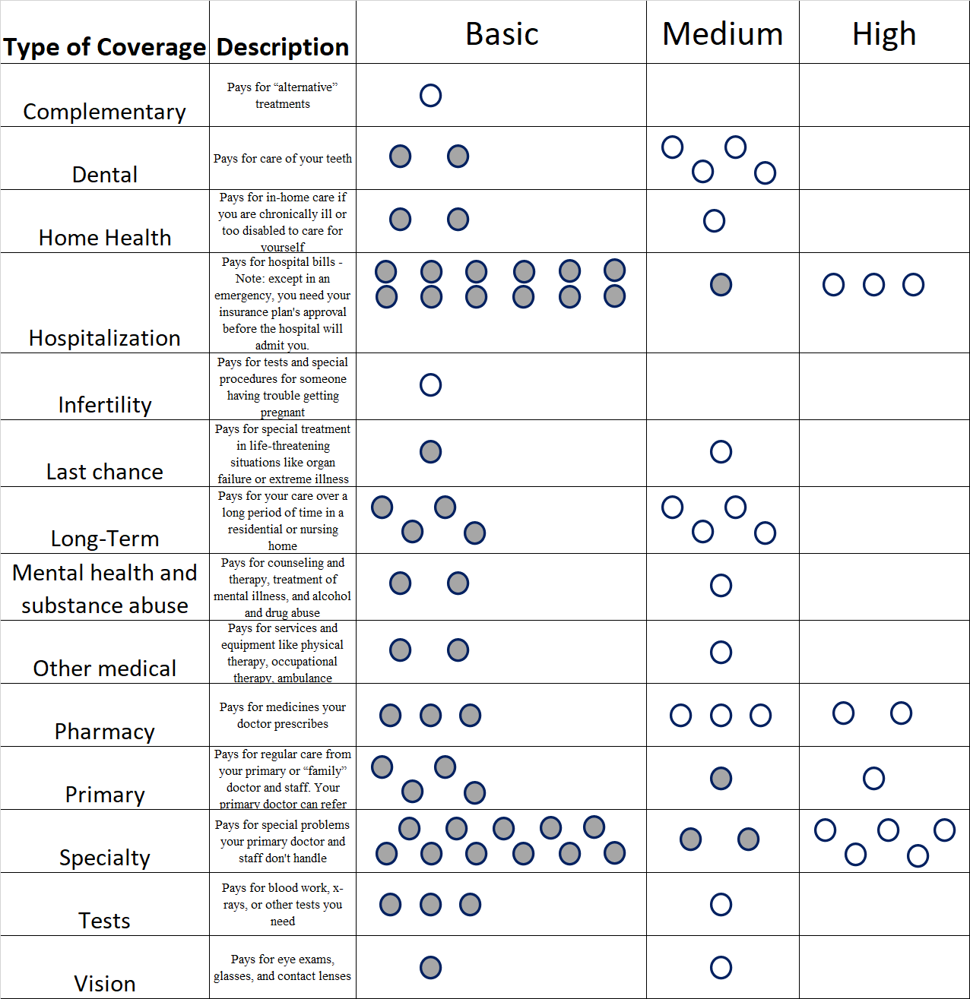
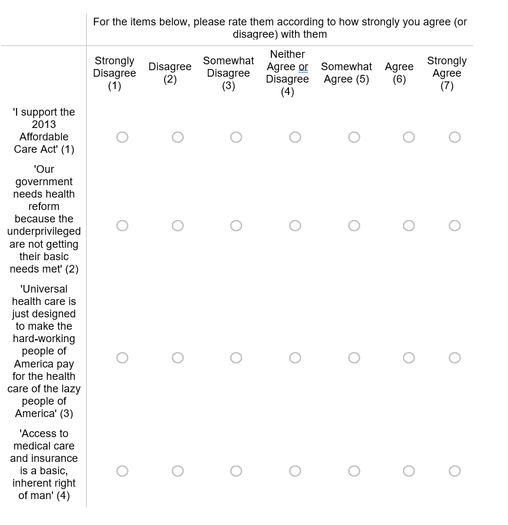

---
output:
  pdf_document: default
  html_document: default
---
# Appendix A

### Experimental Materials for Study 1

```{r appendix_a1, echo=FALSE,fig.cap="Blank CHAT Sheet for 'Active' intervention condition", out.width = '100%'}


```

```{r appendix_a2, echo=FALSE, fig.cap="Legend for 'Active' intervention condition", out.width = '100%'}

````

```{r appendix_a3, echo=FALSE, fig.cap="Blank CHAT Sheet for uninformative control condition", out.width = '100%'}

````

```{r appendix_a4, echo=FALSE, fig.cap="Legend for uninformative control condition", out.width = '100%'}
knitr::include_graphics("appendix_a_4.png")
````

```{r appendix_a5, echo=FALSE, fig.cap="Filled CHAT sheet for 'Passive' intervention condition", out.width = '100%'}

````
```{r appendix_a6, echo=FALSE, fig.cap="Support for UHC Measure - Scale and Item wording", out.width = '100%'}

````


