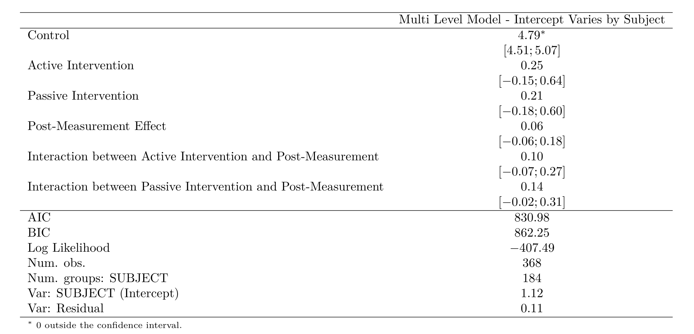

---
output:
  word_document: default
  html_document: default
  editor_options:
    chunk_output_type: console
  chunk_output_type: console
  pdf_document: default
---


```{r study1_setup, include = FALSE}
library(lme4)
library("texreg")
library(ggplot2)
library(knitr)

#study 1 data
setwd("D:/Grad School/2020-2021/psych-masters")
s1_d<-read.csv("study_1_demog.csv")
s1_d<-s1_d[,-1]

UHC_final<-read.csv("study_1_final.csv")
#changing to allow the correct levels
UHC_final$variable <- factor(UHC_final$variable, levels = c("PRESCORE","POSTSCORE"), labels = c("PRE", "POST"))
#rename our condition var's to have actual names
UHC_final$condition <- factor(UHC_final$condition)
levels(UHC_final$condition) <- c("No Intervention", "Active Intervention","Passive Intervention")

study_1_m <- lmer(value ~  condition*variable + (1|SUBJECT), data    = UHC_final)
study_1_m_sum <- summary(study_1_m)
s_1_b<-lm(value ~ condition*variable, data =UHC_final)
```

# Results

#note should we make sure to actually directly ref these results?

Descriptive statistics are summarized in the table above.  Our hypothesis was tested using a linear mixed model fitted to our support for UHC outcome measure. Cronbach’s alpha for the items in this measure was 0.85. In opposition to H1a and H1b, we observed no statistically significant effect in our planned comparison of our active intervention condition t(198.5) = 1.22 ,p = .224, or our passive intervention condition t(198.5) = 1.04 ,p = .299. Additionally, we observed no statistically significant effect in our planned comparison of time t(181) = 1.00 ,p = .317. Finally, we also saw no significant interaction between time and the active condition t(181) = 1.14 ,p = .258, or the passive condition t(181) = 1.67 ,p = .0963. 


```{r study1_tab_freq, tab.cap= "Frequentist Model of Intervention on UHC Support", echo=FALSE, results ="asis"}
texreg(study_1_m, custom.model.names = "Multi Level Model - Intercept Varies by Subject",
       custom.coef.names = c("Control","Active Intervention ","Passive Intervention","Post-Measurement Effect", "Interaction between Active Intervention and Post-Measurement", "Interaction between Passive Intervention and Post-Measurement"),
       caption = "Frequentist Table of Intervention on UHC Support", label = "tab:study_1_tabs",
       ci.force = TRUE) 

```

```{r study_1_table_1_alt, echo=FALSE, out.width="75%", fig.cap="Frequentist Model of Intervention on UHC Support"}

```

For our Bayesian estimation, we had four sampling chains, each with 2000 iterations and 1000 warmup repetitions. This yielded 4000 estimated samples at convergence. Participants in our uninformative control condition had no significant change in support for UHC post intervention (℮ = 4.78, CI =4.49, 5.07) than pre intervention (℮ = 4.84, CI =4.55, 5.13). Participants in our ‘active’ experimental condition had no difference in support for UHC post intervention (℮ = 5.03, CI =4.74, 5.32) than pre intervention (℮ =5.19, CI =4.90, 5.48). Participants in our ‘passive’ experimental condition had no difference in support for UHC post intervention (℮ =4.99, CI =4.70, 1.34) versus pre intervention (℮ = 5.21 , CI =4.92, 5.50). In support of H1a, participants in both intervention conditions had greater support for UHC compared to the control. However, in opposition to H1b, participants in our active intervention condition did not have a greater increase in support for UHC compared to our passive condition.

```{r study1_plot1, fig.cap="Boxplot showing effect of interventions on support for UHC", echo=FALSE}

## Graphs with pre vs post data, boxplot
plot3<-ggplot(UHC_final, aes(x=variable, y=value, color=condition)) +
  geom_boxplot() + labs(title="Effect of Intervention on Support for UHC - Study 1", x = "Time-point (pre or post intervention)", y = "Support for UHC") + 
  scale_color_manual(labels = c("No Intervention", "Active Intervention", "Passive Intervention"), 
                     values=c("red", "blue", "black")) 
plot3 + facet_wrap(~ condition) + theme(legend.position="none")
```

## Qualitative results

Analyzing our free-response question, we found several positive and negative trends in our findings. Some participants felt that the pencil and paper exercise was unnecessarily complex, and that the process of completing it was not self-explanitory. Several occasions occurred wherein the participant asked the administrator how to complete the exercise, after having read through the instructions. In total, 10% of participants expressed some form of confusion in their free response segment, e.g. 
> “It was a little confusing if you aren't very familiar with insurance and health care.”

> “The way that plan was laid out with the pegs was slightly confusing and I think that it might provide more accurate answers if it were formatted more clearly.  Otherwise, I thought that the different levels of care were described well and gave a good picture of what would be provided.”

However, a larger proportion of our participants also found the exercise particularly engaging, interesting, fun, and helpful. In total, 32% of participants expressed some form of positive engagement with the intervention conditions in their free response segment, e.g.

> “I think that is was a good exercise to see what kind of benefits you would want and think about what benefits other people should have also”

> “It was fun trying to make those decisions. I ended up not bubbling any of the 'long term' "retired person" options because I just don't care enough for those benefits. Maybe it's because I'm not in that situation yet.”

We did not predict a priori that our intervention conditions would increase confusion. Nonetheless, an even larger contingent of our participants expressed positive feelings regarding the exercise. Given that the purpose of the interventions were to increase engagement with the often-times boring information necessary to explain UHC, our qualitative data indicates a positive outcome.
