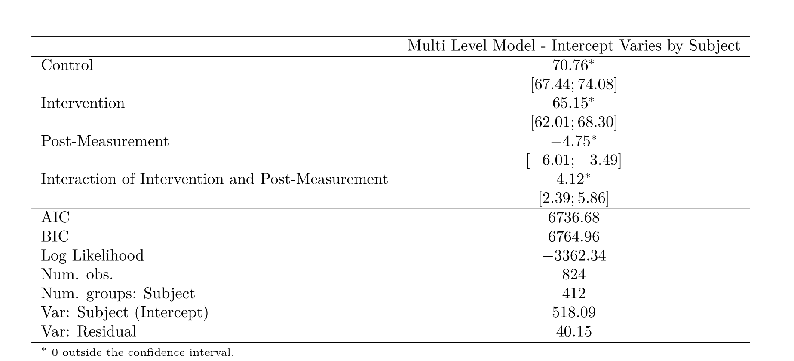
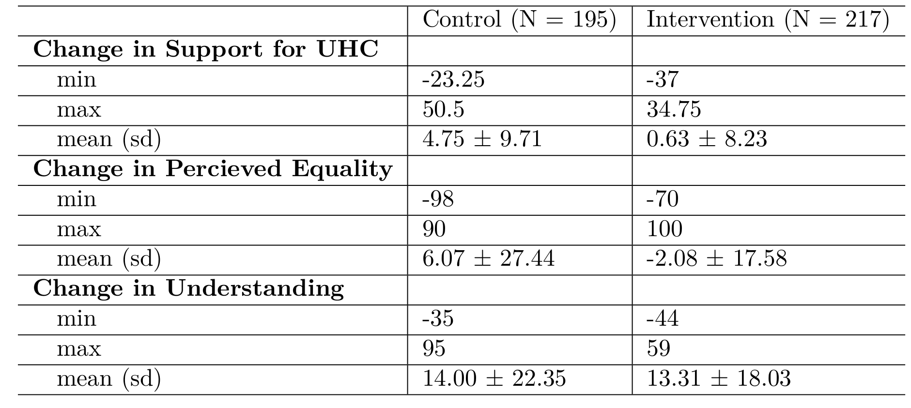

---
output:
  pdf_document: default
  html_document: default
  editor_options: 
    chunk_output_type: console
  chunk_output_type: console
---

```{r study2_setup, include = FALSE}
library(lme4)
library("texreg")
library(ggplot2)
library(qwraps2)

#study 1 data
setwd("D:/Grad School/2020-2021/psych-masters")
UHC<-read.csv("UHC_rdy_for_analysis_2020.csv")
s1_d<-read.csv("study_1_demog.csv")
s1_d<-s1_d[,-1]

UHC_final<-read.csv("study_1_final.csv")
#changing to allow the correct levels
UHC_final$variable <- factor(UHC_final$variable, levels = c("PRESCORE","POSTSCORE"), labels = c("PRE", "POST"))
#rename our condition var's to have actual names
UHC_final$condition <- factor(UHC_final$condition)
levels(UHC_final$condition) <- c("No Intervention", "Active Intervention","Passive Intervention")

library(sem)
library(lavaan)
library(semPlot)
UHC_model<-UHC[,c(11:15,23:35)]

UHC_model_long <- reshape(
  data = UHC_model,
  varying = list(c("Prescore","Postscore"),
                 c("Pre_Equality","Post_Equality"),
                 c("Pre_Understanding","Post_Understanding")),
  idvar = 'Subject',
  v.names = c('UHC_Support', 'Equality', 'Understanding'),
  timevar = 'Time',
  times = c('pre', 'post'),
  direction = 'long'
)
UHC_2<-UHC
UHC_2$change<-UHC$Postscore-UHC$Prescore
UHC_2$change_equality<-UHC$Post_Equality-UHC$Pre_Equality
UHC_2$change_under<-UHC$Post_Understanding-UHC$Pre_Understanding

#using qwraps2 to make our table of means/summary table!~
our_summary1 <-
  list("Change in Support for UHC" =
       list("min"       = ~ min(change),
            "max"       = ~ max(change),
            "mean (sd)" = ~ qwraps2::mean_sd(change)),
       "Change in Percieved Equality" =
       list("min"       = ~ min(change_equality),
            "max"       = ~ max(change_equality),
            "mean (sd)" = ~ qwraps2::mean_sd(change_equality)),
       "Change in Understanding" =
       list("min"       = ~ min(change_under),
            "max"       = ~ max(change_under),
            "mean (sd)" = ~ qwraps2::mean_sd(change_under))
       )
by_cond <- summary_table(dplyr::group_by(UHC_2, condition), our_summary1)


```

# Results

```{r study2_tab1, message=FALSE, warning=FALSE, echo=FALSE, results="asis"}

m1 <- lmer(UHC_Support ~ 0 + condition*Time + (1|Subject), data    = UHC_model_long)
texreg(m1, custom.model.names = "Multi Level Model - Intercept Varies by Subject",
       custom.coef.names = c("Control","Intervention ","Post-Measurement","Interaction of Intervention and Post-Measurement"),
       caption = "Frequentist Table of Intervention on UHC Support", label = "tab:freq-table1",
       ci.force = TRUE)
```

```{r study_2_table_1_alt, echo=FALSE, out.width="75%", fig.cap="Frequentist Model of Intervention on UHC Support"}

```

Descriptive statistics are summarized in the Table above. Hypothesis 1 was analyzed using a linear mixed model fitted to our support for UHC outcome measure. We did not observe a statistically significant linear main effect for our experimental intervention, t (410) = -1.55, p = .122. We did observe a statistically significant linear main effect of time, t (410) = 6.09, p < .001. Support for UHC increased 1.903 points from pre-intervention to post-intervention. We also saw a statistically significant two-way interaction between the linear effect of time and condition, t(410) = -4.662 ,p < .001. In opposition of H1, as illustrated in [Table of Means Here], the intervention condition reduces support for UHC as compared to our control condition. This was opposite to the effect we expected.

```{r study2_tab2, message=FALSE, warning=FALSE, echo=FALSE, results="asis"}
by_cond
```

```{r study_2_table_2_alt, echo=FALSE, out.width="75%", fig.cap="Table of Means"}

```

```{r study2_plot1, fig.cap="Our control condition improved support for UHC while our intervention did not",message=FALSE, warning=FALSE, echo=FALSE}

plot1<-ggplot(UHC_model_long, aes(x=Time, y=UHC_Support, color=condition)) +
  geom_boxplot() 
plot1 + facet_wrap(~ condition)+ scale_color_brewer(palette = "Set1")+labs(x = "Time of Measurement", y = "Support for UHC", title = "Effect of Intervention on Support for UHC - Study 2")+ theme(legend.position="none")

```

## Proposed Mediational Effects

Tingley and colleagues -@Tingley2014 as well as Frazier & Tix -@Frazier2004 describe the necessary procedures to test mediational hypothesis. For H2a, we posit that perceived equity as a mediating variable for the causal effect of our intervention condition on support for UHC. The initial step in fitting our mediation model is to have our measure of perceived equity modelled as a function of our intervention condition and all covariates. Next, we have our support for UHC outcome variable modelled as a function of our measure of perceived equity (the proposed mediator) and the same set of covariates we used in our previous step. Finally, we generate 1000 bootstrap simulations using a quasi-Bayesian monte-carlo method based on normal approximation to estimate the average causal mediational effects and average direct effects of perceived equity on support for UHC. In support of H2a, the effect of our explicit HBP on support for UHC was partially mediated via the perceived equality of the HBP. We observed a statistically significant effect of experimental condition on our proposed mediating variable, perceived equality, t(820) = -3.551 ,p < .001. Perceived equality decreased 10.49 points in our intervention condition compared to our control condition. Furthermore, we observed a statistically significant effect of perceived equality on our outcome variable, support for UHC, t(821) = 18.243 ,p < .001. Support for UHC increased by .424 points for every point of increase in perceived equality. After computing 1000 bootstrapped samples, our estimate for our indirect effect was -2.72 (95% CI = -4.43, -1.03), thus our estimated average causal mediation effect is significant (p = 0.002).  In opposition to H2b, the effect of our explicit HBP on support for UHC was not mediated by the comprehensibility of the HBP.  This is since we do not see a significant effect of experimental condition on our proposed mediating variable, comprehensibility, t(820) = -0.805 , p =0.421.

```{r path_dia_equity, fig.cap="Path Diagram showing the effect of condition on UHC Support and Percieved Equity",message=FALSE, warning=FALSE, echo=FALSE}


UHC_model_long$condition<-as.factor(UHC_model_long$condition)
mediation.model <- "UHC_Support ~ Equality + condition
Equality ~ condition"


med1_m<-lm(Equality~condition,UHC_model_long)
#summary(med1_m)
med3_m<-lm(UHC_Support~condition+Equality,UHC_model_long)
#summary(med3_m)

mediation.fit <- sem(mediation.model, data=UHC_model_long)

semPlot::semPaths(mediation.fit, "par", sizeMan = 8, sizeInt = 8, sizeLat = 8, edge.label.cex=1.5,fade=FALSE)
```

We chose to illustrate our proposed mediational relationship using a path diagram. Again, in support of H1a, we see that there is a mediational relationship between condition and UHC through the effect of perceived equity. Increased perceived equity increases support for UHC, and the control condition both has greater support for UHC, as well as greater perceived equity.

## Moderating Effect of Numeracy

```{r study2_plot2, fig.cap="We see a clear interaction between objective numeracy and the intervention",message=FALSE, warning=FALSE, echo=FALSE}

plot6 <- ggplot(UHC_model_long,aes(x = RNS_score, y = UHC_Support, color = condition)) +
  theme_bw() +
  labs(x = "Objective Numeracy Score",
       y = "Support for UHC",
       color = "Condition",  title = "Moderating Effect of Objective Numeracy on Support for UHC")
plot6 + scale_color_brewer(palette = "Set1")+
  geom_point(position = position_jitter(w = 0.1, h = 0), alpha = .6, size = .9) +
  geom_smooth(method = "lm", alpha =.3, se=FALSE)
```

In partial opposition of H3, in the table above, we see that there is no direct effect of subjective numeracy, ß = 1.784, t(624) = 1.551 ,p = .121, or significant interaction with experimental condition, ß = 1.411, t(624) = -0.867 ,p = .386, on support for UHC. Given the lack of direct effect and interaction, we were unable to find evidence of a moderating effect of subjective numeracy on support for UHC.

In partial support of H3, in the table above, we see a direct effect of objective numeracy on support for UHC, ß = 1.43, t (684) = 2.904, p = 0.004. Support for UHC increases by 1.43 points for each point of increase on the Rasch Numeracy Scale. Furthermore, we also see a significant interaction between the effect of objective numeracy and the condition, ß = 2.78, t (624) = 3.99, p < .001. In our intervention condition, support for UHC increases by an additional 2.78 points for each point of increase on the Rasch Numeracy Scale. Objective, but not subjective, numeracy has a significant effect on support for UHC, with an even greater effect for subjects in our intervention condition. 

```{r study2_plot3, fig.cap="We see no interaction between subjective numeracy and the intervention",message=FALSE, warning=FALSE, echo=FALSE}

plot7 <- ggplot(UHC_model_long,aes(x = SNS_score, y = UHC_Support, color = condition)) +
  theme_bw() +
  labs(x = "Subjective Numeracy Score",
       y = "Support for UHC",
       color = "Condition",  title = "Moderating Effect of Subjective Numeracy on Support for UHC")
plot7 + scale_color_brewer(palette = "Set1")+
  geom_point(alpha = .6, size = .9) +
  geom_smooth(method = "lm", alpha =.3)

```

## Qualitative results

Analyzing our free-response question, we found very similar responses to those in Study 1, but with some significant differences . Unlike Study 1, no participants reported difficulty with comprehending the new activity or confusion regarding the instructions and procedures.. Several participants however reported difficulty regarding the decision making required in the task itself. Some examples include: 

> “it was much more difficult than I thought it was going to be; I had to compromise points in some places to be able to get at least basic coverage in other areas”

> “It’s hard for me to think about people having to pick and choose which parts of healthcare they’ll have access to when they’re all important. It makes me wish healthcare would be reformed for the good of everyone and not just those who can afford it.”

Additionally, replicating what we found in Study 1, 18.4% of intervention condition participants and 8.7% of control condition participants found the activity particularly interesting and fun.  Given that the purpose of the intervention is to increase engagement, this is a positive outcome. An example of these responses:

> “Interesting that my answers changed. I would be interested in seeing someone against Universal Health Care make a study, too.”

> “Enjoyed it, overall I believe that there should be Universal Health Care, but I did not realize how complicated it was. This exercise showed me how complicated it will be if the US decides to go through with something like this.”