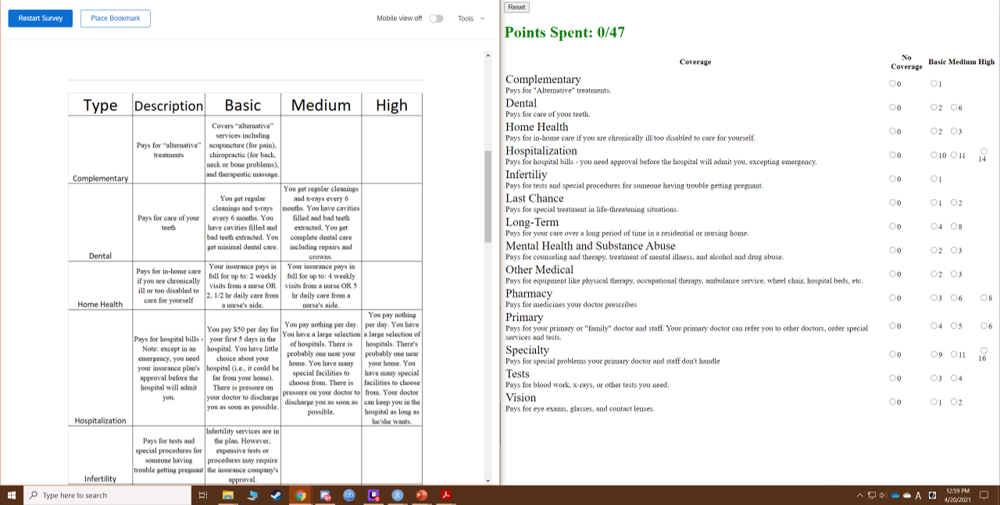

---
output:
  pdf_document: default
  html_document: default
---
# Appendix B

### Experimental Materials for Study 2

```{r appendix_b1, echo=FALSE, fig.cap="Screenshot of Web Exercise for Intervention Condition", out.width = '100%'}

```

```{r appendix_b2, echo=FALSE, fig.cap="Screenshot showing legend and web exercise for intervention condition", out.width = '100%'}

````

```{r appendix_b3, echo=FALSE, fig.cap="1st Infographic for control condition", out.width = '100%'}
knitr::include_graphics("appendix_b_3.png")
````

```{r appendix_b4, echo=FALSE, fig.cap="2nd Infographic for control condition", out.width = '100%'}

````

```{r appendix_b5, echo=FALSE, fig.cap="3rd Infographic for control condition", out.width = '100%'}

````